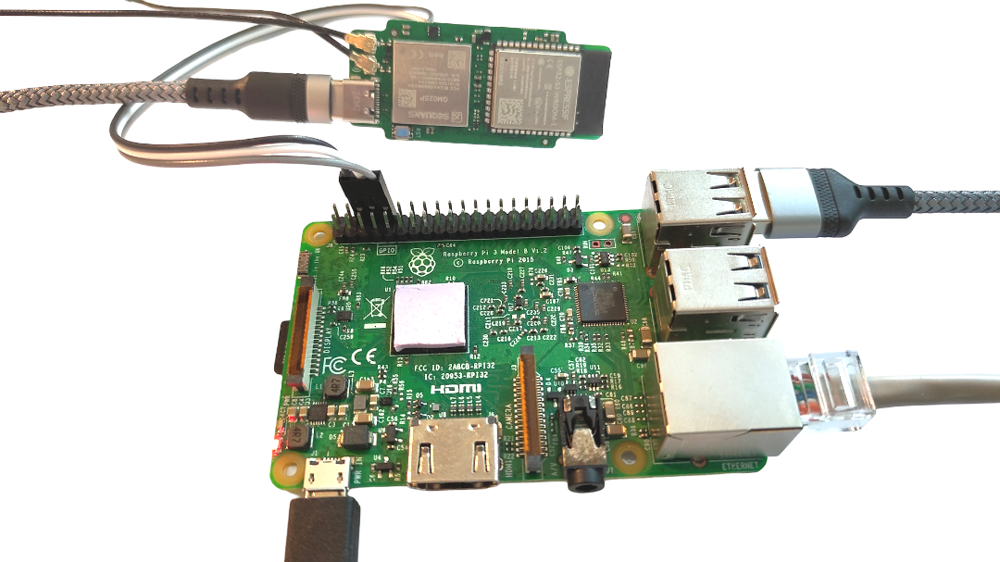
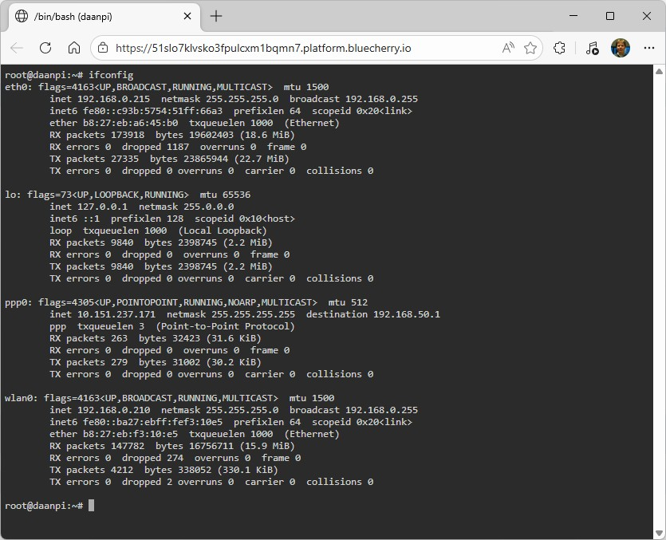

# Walter as a modem for host systems

## Introduction

Walter can be used as a modem for a Linux or other system that connects to the 
internet using a PPP link over serial. This example project shows how Walter can
be programmed to expose the AT command interface of the GM02SP modem over two
serial pins:
 - GPIO8: Walter's RX, to be connected to the host's TX (RPI GPIO14)
 - GPIO9: Walter's TX, to be connected to the host's RX (RPI GPIO15)

This example project will use a Linux host based on Debian, the demo was tested
on a Raspberry Pi 3 Model B. 



## Hardware requirements

In order to run this demonstration you must have the following hardware:
 - A Walter module
 - An LTE antenna
 - A LTE-M SIM card
 - An USB-C cable to power/program Walter
 - A Linux host with a 3.3V TTL serial port
 - 3 DuPont cables

Make the following connections between the host and Walter:

| Walter | Host | Raspberry Pi | Function               |
|--------|------|--------------|------------------------|
| GPIO8  | TX   | GPIO14       | Walter's data receive  |
| GPIO9  | RX   | GPIO15       | Walter's data transmit |
| GND    | GND  | GND          | Common ground          |

## Configuration of Walter's modem

In order to have a good connection on a Linux host system it's important to 
increase the baudrate that the Sequans GM02SP uses to communicate with the
ESP32-S3 on Walter. To configure this you must connect Walter to your
development machine and flash the [standard passthrough example](https://github.com/QuickSpot/walter-arduino/tree/main/examples/passthrough).

Now open a serial terminal to Walter's COM port and execute the following 
commands to configure a baud rate of 921600 on Walter's UART:

```
AT+CFUN=5
AT+SQNHWCFG="uart0","enable","rtscts","921600"
```

Verify that the settings are correct by reading the result of 

```
AT+SQNHWCFG="uart0"
```

Now reset the system with 

```
AT^RESET
```

Now you can go ahead and flash the `walter-as-linux-modem.ino` Arduino sketch
and you should be go to proceed to the next steps of this readme.

## Configuration of the Linux host

This guide assumes a Debian-based system to which you have root access. The
commands given in this guide assume they are executed on a Raspberry Pi host,
but they can be easily adapted to use another serial port.

### Prepare the Raspberry Pi to use the hardware serial port on it's GPIO pins

A Raspberry Pi will not have it's serial port enabled by default and if the
device has a Bluetooth adapter it will use a UART-Lite instead of a full UART
for a connection with the outside world. Use `sudo raspi-config` to enable the 
serial port:
 - 3 Interface Options
 - I6 Serial Port
 - Would you like a login shell to be accessible over serial? --> No
 - Would you like the serial port hardware to be enabled --> Yes

Now we need to disable bluetooth by adding the following two lines to the *end*
of the `/boot/firmware/config.txt` file:

```
dtoverlay=disable-bt
dtoverlay=pi3-disable-bt
```

### Configure the PPP connection

Now install the following applications and reboot the host:

```
sudo apt update
sudo apt install ppp picocom
sudo reboot
```

Now copy the following files from the `etc` directory into the host's `etc`
directory, create the directories if they don't yet exist:
 - `etc/chatscripts/walter` --> `/etc/chatscripts/walter`
 - `etc/chatscripts/walter-disconnect` --> `/etc/chatscripts/walter-disconnect`
 - `etc/ppp/peers/walter` --> `/etc/ppp/peers/walter`

You are now ready to set up the internet connection by dialing the walter modem
from your linux host. The `nodetach debug` can be omitted if everything works as
it will run the ppp client in the background. 

```
sudo pppd call walter nodetach debug
```

If anything would go wrong you can further debug by opening a second terminal 
to the raspberry pi and view the output of the chatscript:

```
journalctl -f | grep chat
```

## Remote shell using BlueCherry.io

### Install the software

Using the BlueCherry platform you can now easily get a remote SSH shel to your 
Linux host. To do this you must request a BlueCherry *type id*, this will soon be
possible by registering on [BlueCherry.io](https://bluecherry.io). 

As soon as you have your *type id* at hand you can go ahead and install the 
following applications and files on your host:
 - `usr/sbin/bluecherry-client` for arm32 or `usr/sbin/bluecherry-client_arm64` for arm64 or  --> `/usr/sbin/bluecherry-client`
 - `usr/sbin/ttyd` --> `/usr/sbin/ttyd`
 - `etc/ttyd/index.html` --> `/etc/ttyd/index.html`
 - `etc/bluecherry/config.yaml` --> `/etc/bluecherry/config.yaml`

Now update the `/etc/bluecherry/config.yaml` with the BlueCherry type id that
you have received from your BlueCherry representative.

### Provision the device

Your device is now ready to provision itself in the BlueCherry platform and
generate the required keys. To do this you must pre-authorize the MAC address.
Issue the `ifconfig` command and give the MAC of the `eth0` interface to your
BlueCherry representative. As soon as you get the green light you can go ahead
and issue the following command:

```
bluecherry-client ztp
```

The device will now provision itself and you can see the process complete in
your BlueCherry dashboard. 

### Connect and access the remote shell

Start the remote connection by running 

```
bluecherry-client &
```

Now you can start the `ttyd` server by running

```
ttyd -I /etc/ttyd/index.html -W /bin/bash
```

You can now access your Linux terminal over LTE Cat-M1 from anywhere in the 
world. The speed will be dependant on the speed of the cellular connection. We
typically see latencies of about 50 to 200ms and between 1KB/s and 10KB/s. More
than enough for remote administration, OTA updates or telemetry.

