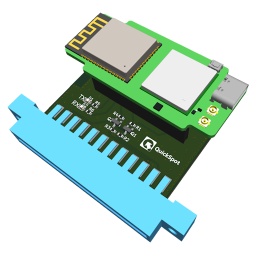
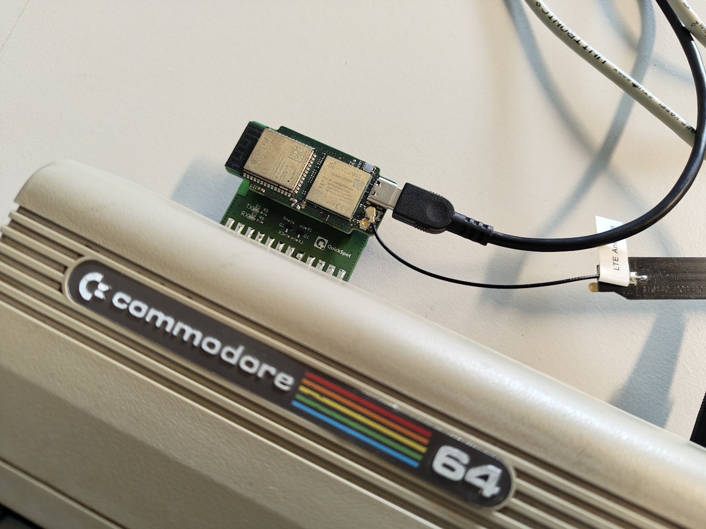

# Walter based Comodore 64 multi-radio modem

## Introduction
This repository contains the hardware design files of a Walter based expansion card for the
Commodore 64 user port. Walter connects to the user port via UART which allows the C64 to make use 
of the connectivity and compute power of the QuickSpot Walter module.

## The hardware

The hardware is based on the [QuickSpot Walter](https://www.quickspot.io) module which combines 
multiple radio technologies in a single module. This gives the C64 multiradio modem access to Wi-Fi,
BLE, LTE Cat-M1, LTE Cat-NB1/2 and GNSS. The module is powered through it's USB-C connector which is
also used to program it. The connection to the C64 is made through the UART which is available on
the user port. 

As the user port's UART is at 5V TTL level and the Walter module's IO ports work at 3.3V a level
shifter is required. Two bi-directional MOSFET based level shifters are implemented on the board.
The high side is fed with the 5V coming from the C64 user port, the low side is fed with the 3.3V 
coming from the Walter module.

## The software

The basic software is the [Walter modem passthrough example](https://github.com/QuickSpot/walter-arduino/tree/main/examples/passthrough) which exposes the AT command interface from the Sequans GM02SP directly
to the C64.