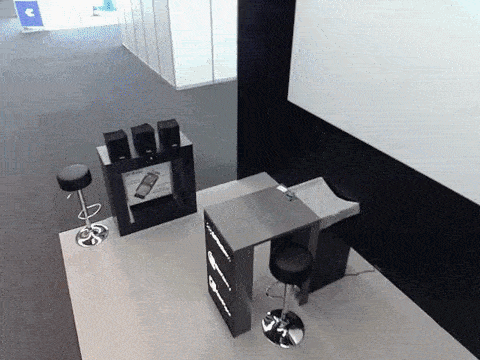
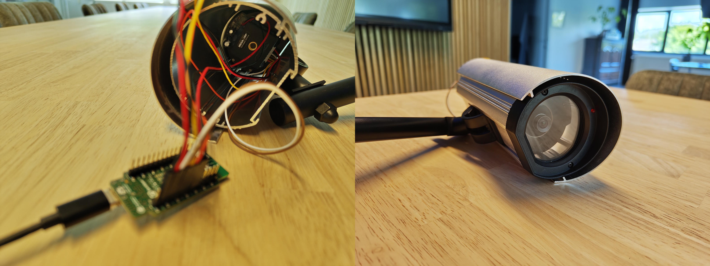

# Walter-based LTE-M Camera

## Introduction

This repository contains an ESP-IDF project demonstrating the  
[QuickSpot Walter](https://www.quickspot.io) module as an LTE-M camera. Possible use cases for this example include:  

- Validating scenarios where sensor readings exceed certain thresholds  
- Performing edge processing of photos or videos and verifying results with occasional images  
- Capturing time-lapse recordings  
- ... and more  

## Hardware

For this example, we are using the [QuickSpot Walter](https://www.quickspot.io) in combination with an  
Arducam B0434 camera module. This setup provides a maximum resolution of 3 MP and an M12 lens mount, allowing different lenses to be installed. The default lens provides a field of view of 90° (diagonal) × 75° (horizontal) × 56.4° (vertical). All hardware is mounted in a dummy surveillance camera enclosure.  

## Software

The software is written in ESP-IDF and built on top of two libraries:  

- Walter Modem  
- Arducam Mega
